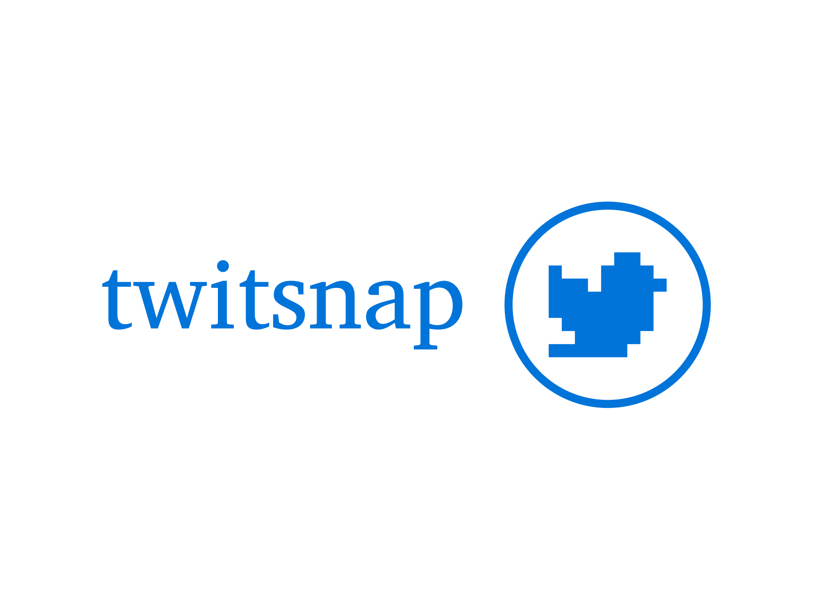

# Twitsnap's manager service




## Table of content

1. [Introduction](#introduction)
2. [Run the project](#run-the-project)
3. [OpenAPI documentation](#openapi-documentation)
4. [Technologies](#technologies)
    - [Languages](#languages)
    - [Packages and tools](#packages-and-tools)
6. [Testing](#testing)
8. [Instructions to make a release](#instructions-to-make-a-release)
    - [Using CI/CD pipeline](#using-cicd-pipeline)
    - [Manually](#manually)

## Introduction
This repository contains the manager service for the Twitsnap application. The manager service is responsible for managing all the services used for the application to work. It is responsible for creating new services, authenticating them, list them, block and more.

## Production swaggers

[https://twitsnap-manager-service.up.railway.app/swagger](https://twitsnap-manager-service.up.railway.app/swagger)

## Run the project
In order to run the project, you should not only run the server but also start the docker container for the database.

To run the project using npm, follow these steps:

1. Create a `.env` file in the root directory of the project with the following content:

   ```env
   ENV=development
   HOSTNAME=localhost
   PORT=4000 # or any other port you want to use

   # Database Config
   POSTGRES_HOST=localhost
   POSTGRES_NAME = manager_db
   POSTGRES_USER = user
   POSTGRES_PASSWORD = password
   POSTGRES_PORT = 5433
   DATABASE_URL = postgresql://${POSTGRES_USER}:${POSTGRES_PASSWORD}@${POSTGRES_HOST}:${POSTGRES_PORT}/${POSTGRES_NAME}?schema=public

   ```

   Replace the URLs with the actual URLs of the services you want to connect to.

   2. Install the dependencies:

   ```bash
   npm install
   ```

3. Start the development server:

    ```bash
    npm run dev
   ```

4. Access the project:

   The manager service will be available at `http://localhost:<port>`.
   _(Note: The actual `[port]` is defined in your .env file, so make sure it's set properly)_

## OpenAPI documentation

The manager service provides an OpenAPI documentation that describes the available endpoints and their usage. You can access the documentation by visiting the `/swagger` route on the running server.
For example, if the service is running on `http://localhost:4000`, you can access the documentation at `http://localhost:4000/swagger`.

## Technologies

### Languages

- TypeScript

### Packages and tools

- Swagger
- dotenv
- Hono
- zod
- Prisma

## Testing

To run the tests, use the following command:

```bash
npm test
```

To run the tests with coverage, use the following command:

```bash
npm run test:ci
```
To run the tests with coverage and see it displayed in the browser, use the following command:

```bash
npm run test:ui
```

## Instructions to make a release

### Using CI/CD pipeline

The CI/CD pipeline is set up to automatically create a release when a new commit is pushed to the repository, by using Github Actions. The pipeline will run the tests, build the project, and push the changes to Railway, where the release will be available at the following URL: `twitsnap-manager-service.up.railway.app/swagger`.

### Manually

To create a release manually, follow these steps:

```bash
docker build -t <image_tag>
```
